## 全新安装MySQL服务器

MySQL是跨平台的服务器,windows操作系统下的使用与linux下的使用几乎一模一样。

我们将会以windows平台为基础来讲解MySQL 服务器的安装。

> 注：Linux操作系统对很多初学者有困难。并且windows具有最广泛的用户，本章讲解以windows安装为主。若您熟悉Linux操作系统，也可自行安装后接着下面课程的学习。

#### 一、下载安装包

1. 百度搜索关键词：mysql server下载
2. 访问官网下载：http://dev.mysql.com/downloads/mysql/

####二、打开安装包，同意协议，下一步

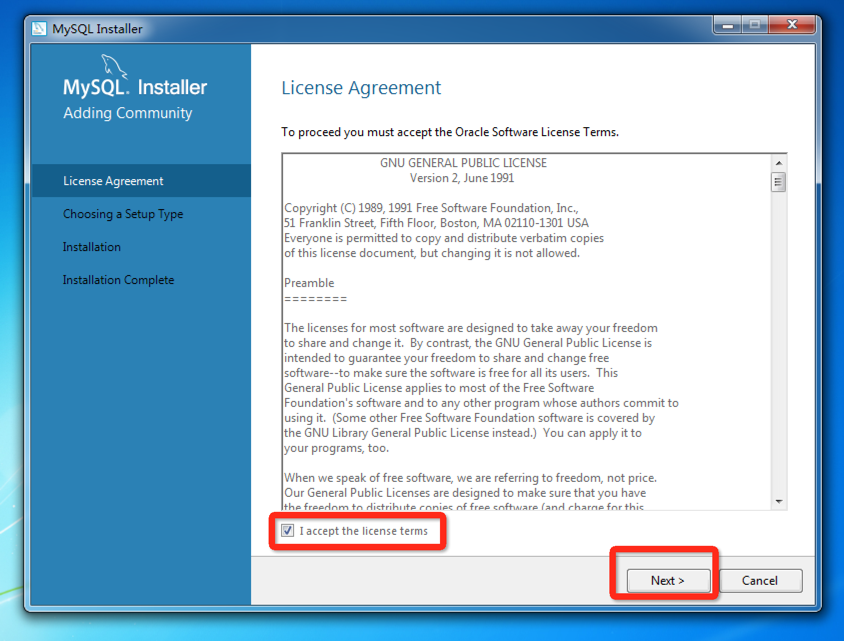

#### 三、选择服务器安装

1. develop 是指服务器为开发机【推荐】
2. server only只安装服务器
3. client only 只安装客户操作端
4. full 全部安装
5. custom 自定义

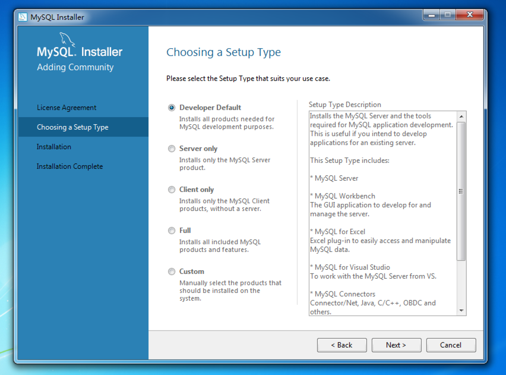

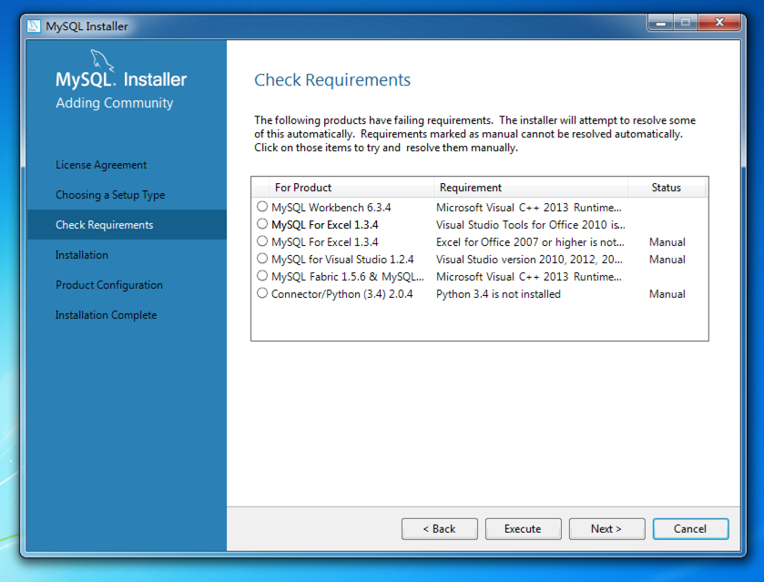

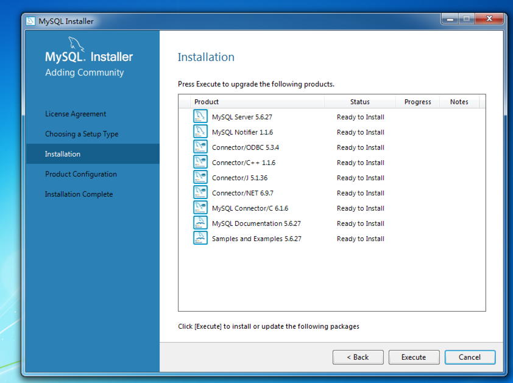

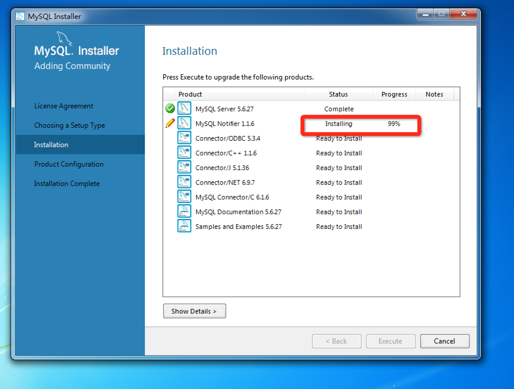

#### 五、服务器参数修改

这一步MySQL server会在界面中显示，由用户勾选完成最后的安装配置文件的自动配置。

其中：
**Config Type（配置文件类型）**
1. Development Machine 是指开发服务器
2. Server Machine 服务器
3. Dedicated Machine 专用服务器仅作为数据库服务器使用

**TCP/IP **
是指开放的端口
mysql 默认的端口是3306

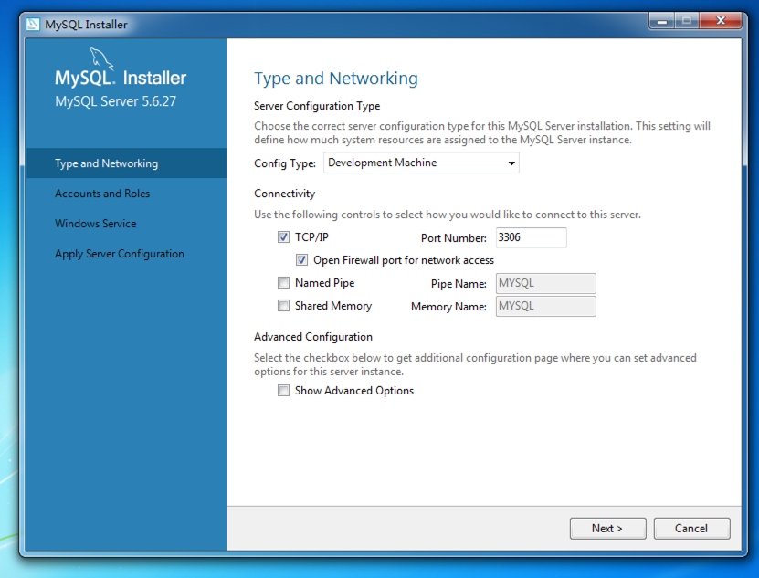

#### 六、设置密码

会提示密码的安全状态

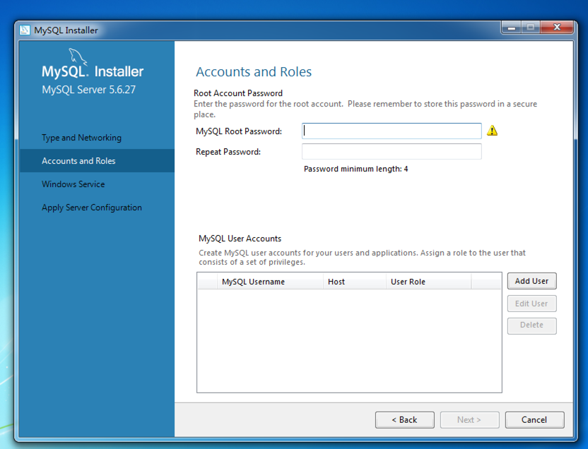

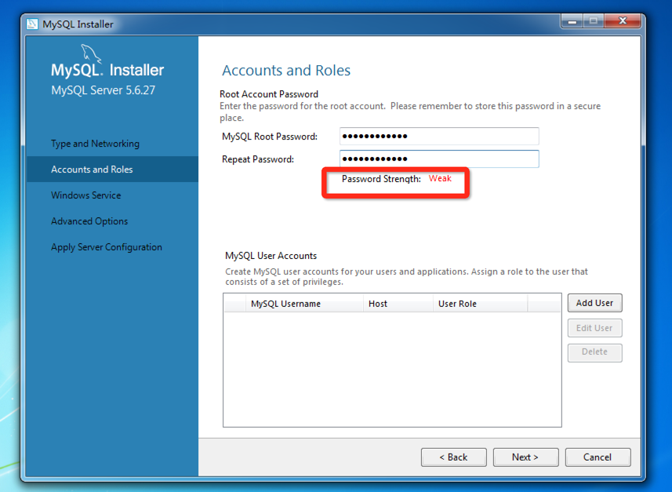

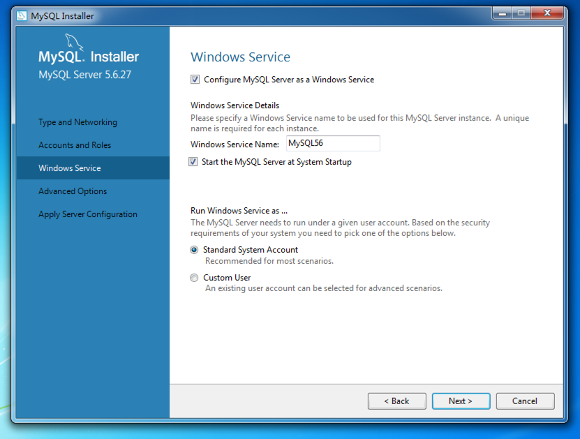

#### 七、日志文件存放位置确认

1. Bin log是二进制文件
2. Error Log 是指错误文件
3. slow Query Log 是慢查询日志

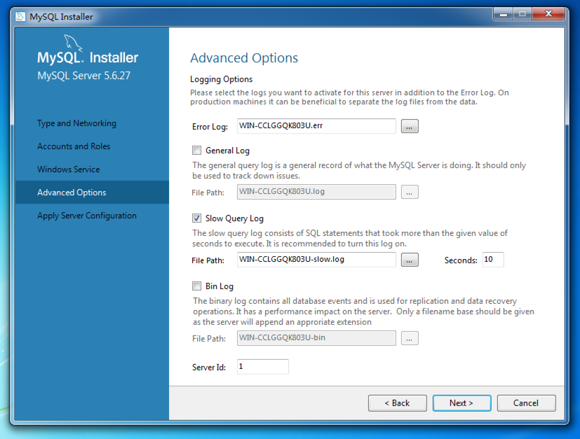

#### 八、启动服务

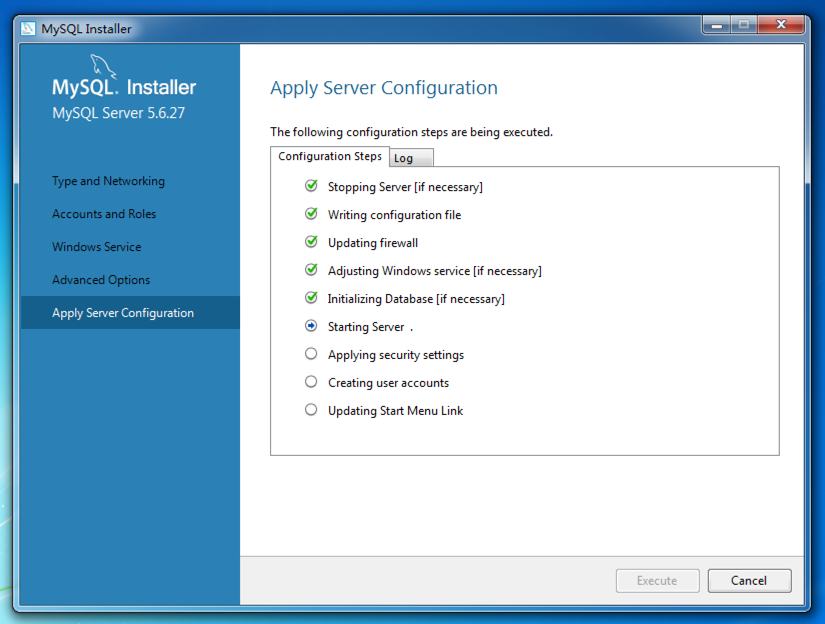

### 恭喜你安装成功了哟！