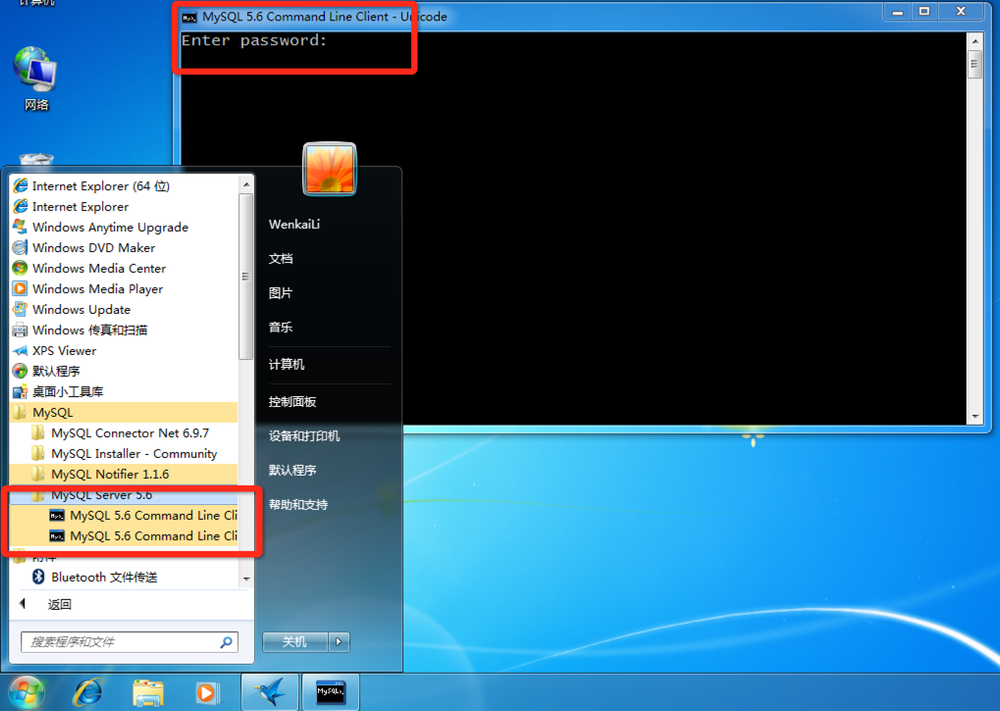

## 方法一

安装后，可以在开始菜单的列表中找到MySQL Command Line 点击操作的命令行终端操作。效果如图：

##方法二

如果加入到了windows的环境变量中，可以在命令行下直接操作。

在命令行下，通过以下命可以连接到数据库服务器：

> mysql -h localhost -u root -p

上面的命令中： mysql 表示 mysql数据库启动工具。

参数说明：

|  参数  | 说明   |
| -- | -- |
|  -h  |  表示数据库连接地址，连接本机可不填  |
|  -u  |  表示要登录的用户  |
|  -p   | 表示使用密码登录   |

注：通常我们不直接输入密码。而是在回车之后，输入密码。因为，密码输入时的字符是不可见的，输完密码直接回车登录。防止旁边有人把重要的密码看走。

如果没有什么别的问题，登陆成功之后会出现下面内容：

> mysql -u root -p
Enter password: 
Welcome to the MySQL monitor.  Commands end with ; or \g.
Your MySQL connection id is 7
Server version: 5.6.25 MySQL Community Server (GPL)

> Copyright (c) 2000, 2015, Oracle and/or its affiliates. All rights reserved.

> Oracle is a registered trademark of Oracle Corporation and/or its
affiliates. Other names may be trademarks of their respective
owners.

> Type 'help;' or '\h' for help. Type '\c' to clear the current input statement.

> mysql> 

上面的中文意思翻译过来是说，欢迎使用MySQL的命令行操作工具。每一个命令结束可以输入\g 或者 ;

mysql当前是第 7次连接。

当前数据库的版本是5.6.25社区支持版。遵循GPL协议。

版权所有：2000至 2015。归Oracle及其子机构拥有所有权。

如果需要帮助的话，通过 ‘help;’ 或者 ‘\h’ 命令来显示帮助内容，通过 ‘\c’ 命令来清除命令行历史。

**mysql>**

mysql > 表示等待输入指令。

***
注：

在登陆成功后有这么一句提示，可能大家不太理解：

Your MySQL connection id is 7

表示第7次连接登陆，每登陆一次这个id为加1。下一次显示的会是第8次。

你可以实验试试哟：）

