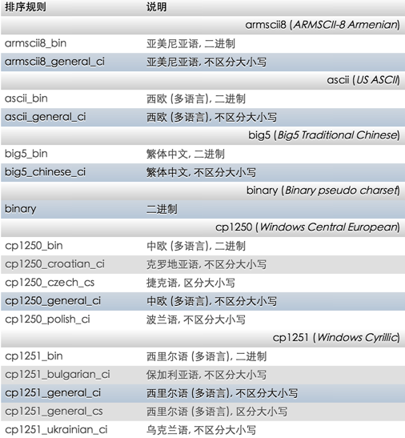

##字符集是什么？
为了更好的识别中文、日文、英文、希腊语。对于常用的符号进行了编码，这个编码就是字符集。

字符集确定了文字的存储方式。

字符集相当于是计算机中人类的语言。

举个例子：

我说的是英文，所以我存储的时候要用英文文字来存储。
如果我说的是中文，用英文字符来存储的话。那么人们就看不懂也看不明白，就是我们所说的乱码。

因为字符集太多了，足够有几十种上百种之多。所以我们不需要了解太多的字符集的知识，甚至不需要了解字符集到底是如何编成人类可见字符的。

##字符集的重点知识

我们只需要了解：
1. 常用字符集
2. 数据库中我们用什么字符集

英文字符集：

| 字符集   |  说明 | 字节长度 |
| -- | -- | -- |
|  ASCII  |美国标准信息交换代码    | 单字节| 
| GBK | 汉字内码扩展规范|  双字节| 
| unicode| 万国码 | 4字节| 
|UTF-8| Unicode的可变长度字符编码 | 1到6个字节|

###ASCII
ASCII 码使用指定的7 位或8 位二进制数组合来表示128 或256 种可能的字符。标准ASCII 码也叫基础ASCII码，使用7 位二进制数来表示所有的大写和小写字母，数字0 到9、标点符号， 以及在美式英语中使用的特殊控制字符。
其中：
0～31及127(共33个)是控制字符或通信专用字符（其余为可显示字符），如控制符：LF（换行）、CR（回车）、FF（换页）、DEL（删除）、BS（退格)、BEL（响铃）等；通信专用字符：SOH（文头）、EOT（文尾）、ACK（确认）等；ASCII值为8、9、10 和13 分别转换为退格、制表、换行和回车字符。它们并没有特定的图形显示，但会依不同的应用程序，而对文本显示有不同的影响。
32～126(共95个)是字符(32是空格），其中48～57为0到9十个阿拉伯数字。
65～90为26个大写英文字母，97～122号为26个小写英文字母，其余为一些标点符号、运算符号等。

###GBK

GBK 向下与 GB 2312 编码兼容。是中华人民共和国定义的汉字计算机编码规范。早期版本为GB2312。

###Unicode

Unicode（统一码、万国码、单一码）Unicode是国际组织制定的可以容纳世界上所有文字和符号的字符编码方案。以满足跨语言、跨平台进行文本转换、处理的要求。

###UTF-8
是一种针对Unicode的可变长度字符编码，也是万国码。因为UNICODE比ASCII占用大一倍的空间，而对ASCII来说高字节的0对他毫无用处。为了解决这个问题，就出现了一些中间格式的字符集，他们被称为通用转换格式，即UTF（Universal Transformation Format）

##实际工作中要使用的编码

在中文中常用的字符集分为utf-8和GBK。

实际使用的如下：

| 字符集 | 说明  |
| -- |  --|
| gbk_chinese_ci |简体中文, 不区分大小写  |
| utf8_general_ci | Unicode (多语言), 不区分大小写 |

观察（图一）的特点你会发现，MySQL字符集由三个部分组成：
1.字符集 
2.语言
3.类型

最后的bin是指二进制字符集，后面的ci是指存储排序时不区分字符的大小写。

> 注意：
mysql在写utf-8的时候写的是utf8。不加中间的中横线。

***

（图一）

